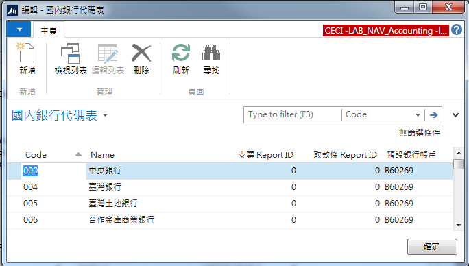

# 議題-Q:如何輕輕鬆鬆製作取款條

---
**Step 1:**

找到國泰世華取款條列印畫面的Report ID (方法請見*xxxx*) : 50022

**Step 2**

在NAV Dev Report中找到並點選 50022 Withdrawal Slip (Cathay) 此Report ， 按下Design按鈕，在功能列File中點選Save As ， 輸入欲新增之ID及Name。

**Step 3**

在NAV Dev Table中找到50510 Bank Info 按下Run，找尋欲製作銀行取款條之銀行，設定相對應的取款條Report ID(上步驟新建之ID)及設定對應之預設銀行帳戶。

